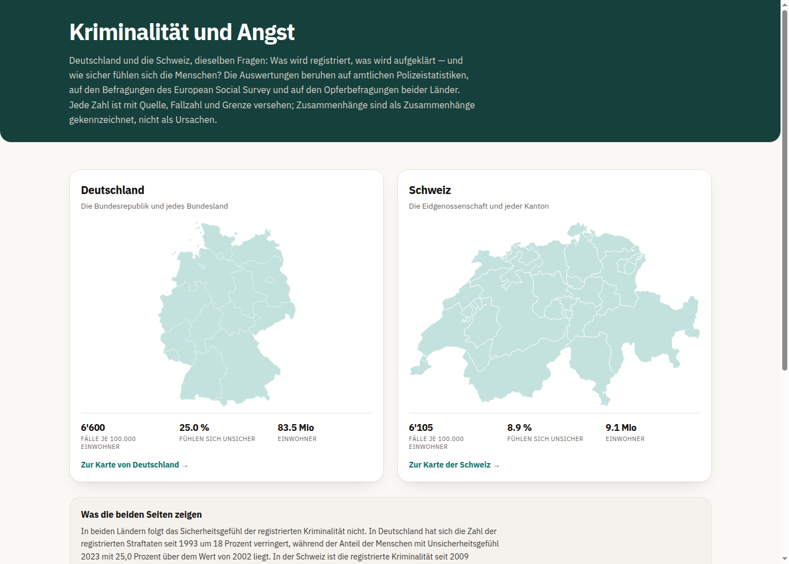

# Kriminalität und Angst — Deutschland und die Schweiz

Eine Web-App zur Frage, wie registrierte Kriminalität, Strafverfolgung und das
Sicherheitsgefühl der Bevölkerung zusammenhängen — für Deutschland und die
Schweiz, jeweils insgesamt und für jede Region.

**Zur App:** <https://kriminalitaet-sicherheit-de.onrender.com>



## Drei Seiten

| Datei | Titel | Inhalt |
|---|---|---|
| `index.html` | Kriminalität und Angst | Startseite: kurze Beschreibung und zwei anklickbare Karten (Deutschland links, Schweiz rechts) |
| `deutschland.html` | Die (un)berechtigte Furcht vor Kriminalität in Deutschland | Bundesländerkarte als Einstieg, alles Weitere in Reitern darunter |
| `schweiz.html` | Die (un)berechtigte Furcht vor Kriminalität in der Schweiz | Karte der 26 Kantone als Einstieg, gleicher Aufbau und gleiche Titelform |

Die Startseite ist bewusst leicht (rund 190 KB, kein JavaScript, keine
Diagramm-Bibliothek): Sie ist eine Tür, keine Auswertung. Die beiden
Länderfassungen sind je eine eigenständige HTML-Datei mit eingebetteter
Diagramm-Bibliothek und eingebetteter Schrift — sie laufen auch ohne Netz.

## Was die App zeigt

**Deutschland**

- **Karte** — einfärbbar nach Kriminalitätsbelastung, Unsicherheitsgefühl,
  Aufklärungsquote, Migrationsanteil, Ausländeranteil, Bevölkerungsdichte,
  Arbeitslosenquote, BIP je Einwohner und verfügbarem Einkommen. Der Klick auf
  ein Bundesland öffnet sein Profil mit allen Kennzahlen.
- **Kriminalität** — Häufigkeitszahl und Aufklärungsquote der Bundesländer, die
  Zeitreihe ab 1987, der Vergleich mit anderen europäischen Ländern über sechs
  Delikte, politisch motivierte Kriminalität.
- **Furcht** — Unsicherheitsgefühl im Zeitverlauf, welche Delikte die Menschen
  fürchten, wie sich das nach Altersgruppen verschoben hat.
- **Strafverfolgung** — wie viele registrierte Fälle aufgeklärt werden und wie
  viele davon zu einer Verurteilung führen.

**Schweiz**

- **Karte** — einfärbbar nach Kriminalitätsbelastung, Einbruchdiebstahl,
  Diebstahl, Straftaten gegen Leib und Leben, Aufklärungsquote,
  Unsicherheitsgefühl, Betroffenheit, Ausländeranteil und Bevölkerungsdichte.
  Der Klick auf einen Kanton öffnet sein Profil.
- **Kriminalität** — Häufigkeitszahl und Aufklärungsquote der Kantone, die
  Zeitreihe ab 2009, der Vergleich mit Deutschland in der harmonisierten
  Deliktgliederung von Eurostat, die Streuung zwischen den Kantonen.
- **Furcht** — Unsicherheitsgefühl im European Social Survey, dasselbe
  Instrument wie für Deutschland; dazu die Schweizer Befragungen zum
  Sicherheitsgefühl, die Furcht vor Einbruch, das Vermeidungsverhalten und die
  Anzeigebereitschaft.
- **Strafverfolgung** — Aufklärungsquote nach Delikt und Kanton, vom Vorfall
  zur Anzeige.

## Der inhaltliche Kern

Registrierte Kriminalität und Furcht folgen einander **nicht** — in keinem der
beiden Länder.

*Deutschland:* Mecklenburg-Vorpommern hat die niedrigste Kriminalitätsbelastung
und das höchste gemessene Unsicherheitsgefühl; Bayern hat beides niedrig.

*Schweiz:* Die Zentralschweiz fühlt sich am sichersten, die Nordwestschweiz am
unsichersten — im Tessin ist die Betroffenheit am höchsten, die Furcht aber
unterdurchschnittlich. Zwischen 2011 und 2015 fiel die registrierte
Einbruchshäufigkeit um ein Viertel, während die Furcht vor einem Einbruch von
25,4 auf 33,1 Prozent **stieg**.

In beiden Ländern ist der stärkste Einzelbefund das Geschlecht: Frauen fühlen
sich deutlich häufiger unsicher, ohne häufiger betroffen zu sein. Das Niveau
unterscheidet sich allerdings stark — 2023 fühlen sich in Deutschland 25,0
Prozent unsicher, in der Schweiz 8,9 Prozent, bei der gleichen Frage im gleichen
Erhebungsprogramm.

## Datenquellen

| Bereich | Quelle |
|---|---|
| Kriminalität Deutschland | BKA, Polizeiliche Kriminalstatistik 2025 (Länder-Grundtabelle, T01-Zeitreihe, T12 aufgeklärte Fälle, SKiD 2024/2020) |
| Strafverfolgung Deutschland | Statistisches Bundesamt, Statistischer Bericht Strafverfolgung 2024 |
| Furcht Deutschland | European Social Survey, Runden 1–11 (eigene Berechnung, gewichtet) |
| Strukturdaten Deutschland | Statistisches Bundesamt / Statistikportal (Zensus 2022, Mikrozensus); Arbeitskreis VGR der Länder; Statistik der Bundesagentur für Arbeit |
| Kriminalität Schweiz | Bundesamt für Statistik, Polizeiliche Kriminalstatistik (STAT-TAB, `px-x-1903020100_101`), 2009–2025; Wohnbevölkerung (`px-x-0102020000_101`) |
| Furcht Schweiz | European Social Survey, Runden 1–11 (eigene Berechnung, gewichtet); Swiss Crime Survey 2022 (ZHAW / Universität St. Gallen im Auftrag der KKPKS, n = 15'519); Schweizerische Sicherheitsbefragung 2015 (Killias Research & Consulting, n = 2'004) |
| Beide Länder im Vergleich | Eurostat `crim_off_cat`, harmonisierte ICCS-Gliederung |
| Kartengeometrie | Eurostat/GISCO, NUTS-1 für die Bundesländer und NUTS-3 für die Kantone, CC BY 4.0 |

Rohdaten und Befragungsdaten liegen nicht in diesem Repository (siehe
`.gitignore`). Die Auswertungsergebnisse liegen als CSV in `output/`.

## Aufbau

```
dashboard/
  index.html        Startseite          (aus build_start.py)
  deutschland.html  Deutschland-Fassung (aus build_app.py)
  schweiz.html      Schweizer Fassung   (aus build_ch.py)
  build_app.py      erzeugt deutschland.html aus den Auswertungsdateien
  build_ch.py       erzeugt schweiz.html (nutzt CSS und Schrift von build_app.py)
  build_start.py    verschiebt die Deutschland-Fassung und baut die Startseite
  fonts/            die eingebettete Schrift (IBM Plex Sans)
scripts/            Analyse-Skripte, numerisch durchnummeriert; 40–46 ist die
                    Schweizer Datenpipeline (BFS-Schnittstelle, Bevölkerung,
                    ESS, Kartengeometrie, Kennzahlen, Referenzwerte, Eurostat)
output/             Auswertungsergebnisse als CSV
docs/               Datenquellen und Methodenhinweise
```

## Selbst bauen

Die Reihenfolge ist wichtig, weil `build_start.py` die Deutschland-Fassung
verschiebt:

```bash
cd dashboard
python3 build_app.py     # -> deutschland.html
python3 build_ch.py      # -> schweiz.html
python3 build_start.py   # -> index.html (Startseite)
```

Die Schweizer Daten werden mit sieben Skripten erhoben und aufbereitet. Sie
greifen auf die offene Schnittstelle des Bundesamts für Statistik, auf Eurostat
und auf die ESS-Rohdaten zu:

```bash
python3 scripts/40_ch_pks_bfs.py          # Polizeiliche Kriminalstatistik
python3 scripts/41_ch_bevoelkerung_bfs.py # Wohnbevölkerung, Ausländeranteil
python3 scripts/42_ch_ess_extraktion.py   # ESS Schweiz, Runden 1-11
python3 scripts/43_ch_geo_svg.py          # Kantonsgeometrie
python3 scripts/44_ch_kennzahlen.py       # Häufigkeitszahl, Aufklärungsquote
python3 scripts/45_ch_referenzwerte.py    # Befragungswerte mit Belegstelle
python3 scripts/46_ch_eurostat.py         # Deutschland/Schweiz harmonisiert
```

Voraussetzungen: Python 3 mit `plotly` und `numpy`; für die Analyse-Skripte
zusätzlich `pandas`, `statsmodels`, `scipy` sowie R mit `lavaan`. `build_ch.py`
liest `build_app.py` als Modul, damit beide Länderfassungen dasselbe CSS und
dieselbe Schrift verwenden.

## Prüfen

Die Zahlen werden beim Bauen gegen ihre Quelle kontrolliert, nicht nur einmal
beim Erstellen:

- `scripts/40_ch_pks_bfs.py` prüft das Schweiz-Total gegen den veröffentlichten
  Wert des Bundesamts für Statistik (554'963 Fälle für 2025).
- `scripts/44_ch_kennzahlen.py` prüft die Summe der Kantone gegen das
  Schweiz-Total und dass die Tabelle nur die 26 Kantone enthält.
- `scripts/27_live_pruefen.py` prüft die veröffentlichte Fassung, nicht die
  lokale.
- `scripts/35_js_pruefen.py`, `36_uebersetzungsstand.py`,
  `37_sprachpruefung.py`, `38_app_pruefen.py` prüfen die englische Fassung und
  die Diagramme im Browser.

Für die Sichtprüfung der Diagramme legt `dashboard/_verify/ch/` je Diagramm
eine kleine Seite an und fotografiert sie ab; das Bild lässt sich dann direkt
ansehen, statt die ganze Seite zu durchsuchen.

## Deployment

Statische Website, kein Server nötig. `render.yaml` ist enthalten: Repository
bei Render verbinden, als **Static Site** anlegen (nicht Web Service), Publish
Directory `dashboard`, Build Command leer. Render veröffentlicht bei jedem Push
auf `main` automatisch neu.

Wichtig: Das Repository enthält **keine** Umleitungsregel auf `index.html`. Die
drei Seiten sind einzeln verlinkt; eine Regel `/* -> /index.html` würde die
Länderfassungen überschreiben.

## Grenzen

- Alle Angaben sind **registrierte** Kriminalität (Hellfeld) — was nicht
  angezeigt wird, erscheint nicht in der Statistik, und ein registrierter Fall
  ist kein Nachweis einer Straftat.
- Beide Polizeistatistiken zählen nach dem **Tatortprinzip**: Fälle werden dort
  verbucht, wo die Tat begangen wurde, geteilt wird durch die dort wohnhafte
  Bevölkerung. In Stadtstaaten, Stadtkantonen und Ballungsräumen mit vielen
  Einpendlern und Gästen fällt die Häufigkeitszahl dadurch höher aus.
- Die Schweizer Reihe erfasst **nur das Strafgesetzbuch**. Widerhandlungen
  gegen das Betäubungsmittel- und das Ausländerrecht — im BFS-Total rund ein
  Fünftel aller registrierten Straftaten — fehlen. Die deutsche Häufigkeitszahl
  ist mit der schweizerischen deshalb nicht unmittelbar vergleichbar; für den
  Ländervergleich wird die harmonisierte Gliederung von Eurostat verwendet.
- Auch die **Aufklärungsquoten** beider Länder sind nicht vergleichbar: Sie
  beziehen sich auf unterschiedlich abgegrenzte Delikte.
- **Kantonale Furchtwerte gibt es nicht.** Keine Schweizer Befragung ist
  kantonal repräsentativ; die App weist die sieben Grossregionen aus dem
  European Social Survey aus, und der Wert gilt für die Region, nicht für den
  einzelnen Kanton. In der deutschen Fassung stammen die Länderwerte aus
  gepoolten Befragungswellen mit 121 bis 3.332 Befragten je Land; Werte unter
  etwa 300 Befragten sind gekennzeichnet.
- Die Karten färben nach **Rangstufen**, nicht nach gleichen Wertabständen.
  Gleiche Farbunterschiede bedeuten dort nicht gleiche Zahlenunterschiede; für
  genaue Werte dienen Rangliste und Länder- bzw. Kantonsprofil.
- Befragungszeitreihen sind Momentaufnahmen unabhängiger Stichproben, kein
  Panel. Alle Zusammenhangsaussagen beruhen auf Querschnittsdaten und belegen
  keine Ursachen.
- **Offener Prüfpunkt:** In der Schweizer Statistik führt das Bundesamt für
  Statistik die Diebstahlsformen als einzelne Zeilen; die Zeile „Diebstahl
  (Art. 139)" fällt dabei kleiner aus als einzelne Unterformen. Ob sie die
  Summe oder eine Restkategorie bezeichnet, ist noch nicht geklärt. Die
  harmonisierte Eurostat-Zahl liegt deutlich höher als diese Reihe. Bis zur
  Klärung ist die Diebstahlsreihe der Schweizer Fassung mit Vorbehalt zu lesen.

## Lizenz und Herkunft

Der Code steht unter keiner besonderen Lizenz. Die verwendeten Daten stammen
von den genannten amtlichen Stellen; für die Kartengeometrie gilt CC BY 4.0
(Eurostat/GISCO). Die Nutzungsbedingungen des European Social Survey sind zu
beachten; die Befragungsdaten selbst liegen nicht im Repository.

Erstellt von **Christopher Vantis** mit **Hermes** (KI-Assistent). Auswahl der
Fragen, Deutung und Prüfung der Ergebnisse liegen beim Autor; Recherche,
Auswertung und Umsetzung entstanden im Dialog mit dem Assistenten.
